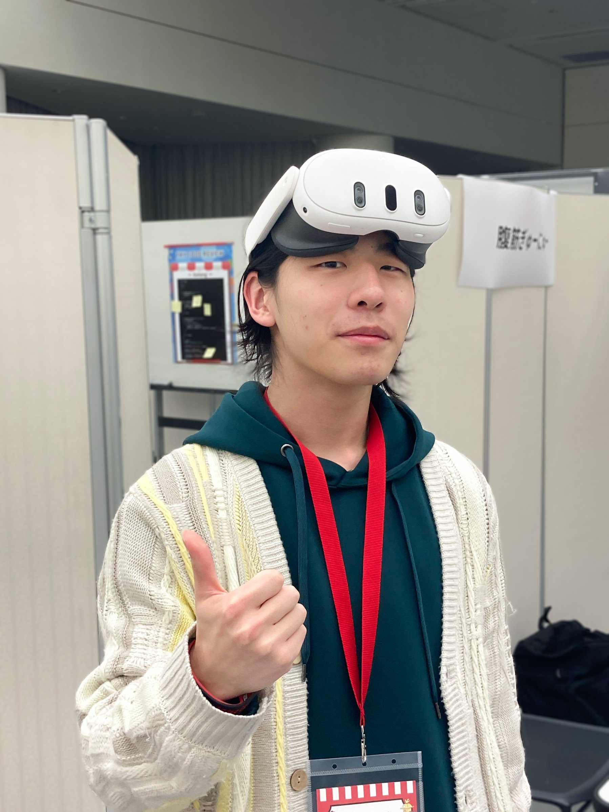

 
 

# 同人音楽のすすめ

〜このセカイには誰にも見つかっていないだけでもっと魅力的な音楽がきっとある話〜

 
 

**しばいぬ / kanakanho**

---

# 自己紹介

 

## しばいぬ / kanakanho

web フロント・XR やってます

MetaQuest / VisionPro / webXR etc...

 

@Shiba_ao\_

@kanakanho

---

# 同人音楽のすすめ

〜このセカイには誰にも見つかっていないだけでもっと魅力的な音楽がきっとある話〜

---

<!-- 

# 本日の目標

**SoundCloud** アカウントを作ってもらう

--- -->

# 同人音楽とは？

個人が好きに作っている音楽

---

# 同人音楽とは？

❌ 売るための音楽

 
 
 
 

---

# 同人音楽とは？

❌ 売るための音楽

**作者の好き**が濃縮

---

<!-- 

# 同人音楽を聴く中で話し手が持っているマインド

--- -->

<!-- 

# 同人音楽を聴くマインド

 

- **魂が好きか**

 

&nbsp;

 

--- -->

<!-- 

# 同人音楽を聴くマインド

 

- 魂が好きか

 

- **興味ないか**

 

--- -->

<!-- 

# 同人音楽を聴くマインド

 

- 魂が好きか

 

- 興味ないか

 

**嫌いな同人音楽なんてない**

--- -->

# 同人音楽って近くにあるかも...

同人音楽界隈から派生した例を紹介

---

# 同人音楽界隈から派生した例

 

Unwelcome School / ミツキヨ

<iframe
  width="800"
  height="500"
  src="https://embed.nicovideo.jp/watch/sm40875076"
  allowfullscreen
  scrolling="no"
  allow="accelerometer; clipboard-write; encrypted-media; gyroscope; picture-in-picture;"
  ></iframe>

<!-- 

<iframe width="480" height="480" src="https://www.youtube.com/embed/bhABIic1K44" title="Unwelcome School" frameborder="0" allow="accelerometer; autoplay; clipboard-write; encrypted-media; gyroscope; picture-in-picture; web-share" referrerpolicy="strict-origin-when-cross-origin" allowfullscreen></iframe>

 -->

---

# 同人音楽界隈から派生した例

 

Unwelcome School / ミツキヨ

<!-- 

<iframe
  width="800"
  height="600"
  src="https://embed.nicovideo.jp/watch/sm40875076"
  allowfullscreen
  scrolling="no"
  allow="accelerometer; clipboard-write; encrypted-media; gyroscope; picture-in-picture;"
  ></iframe>

 -->

<iframe width="480" height="480" src="https://www.youtube.com/embed/bhABIic1K44" title="Unwelcome School" frameborder="0" allow="accelerometer; autoplay; clipboard-write; encrypted-media; gyroscope; picture-in-picture; web-share" referrerpolicy="strict-origin-when-cross-origin" allowfullscreen></iframe>

---

# 唐突に作曲者紹介

**ミツキヨ** さんとは

---

# 唐突に作曲者紹介

<!-- 
 -->

ミツキヨ

 

## 代表レコード

- 夢箱
- ユメの喫茶店

## おすすめ曲

<iframe width="100%" height="200" scrolling="no" frameborder="no" allow="autoplay" src="https://w.soundcloud.com/player/?url=https%3A//api.soundcloud.com/tracks/565835109&color=%23ff5500&auto_play=false&hide_related=false&show_comments=true&show_user=true&show_reposts=false&show_teaser=true&visual=true"></iframe>
<a href="https://soundcloud.com/mitsukiyo_5" title="ミツキヨ" target="_blank" style="color: #cccccc; text-decoration: none;">ミツキヨ</a> · <a href="https://soundcloud.com/mitsukiyo_5/chocolate-lemon-free-download" title="Chocolate Lemon [Free Download]" target="_blank" style="color: #cccccc; text-decoration: none;">Chocolate Lemon [Free Download]</a>

---

# 同人音楽に今すぐに**ハマれる人**

---

# 同人音楽に今すぐにハマれる人

 

- 音ゲー
- ゲーム BGM
- ボカロ
- EDM

---

# 同人音楽に今すぐにハマれる人

 

- 音ゲー
- ゲーム BGM
- ボカロ
- EDM

ようこそ**同人音楽沼**へ

---

<!-- header:  -->

# おすすめの音楽のジャンルと楽曲紹介

---

# Future Core

 

- **PSYQUI**

Don&#x27;t you want me feat. Such

- **ゆーしえ (YUC&#x27;e)**

POISON

<iframe width="100%" height="300" scrolling="no" frameborder="no" allow="autoplay" src="https://w.soundcloud.com/player/?url=https%3A//api.soundcloud.com/tracks/480595932&color=%23ff5500&auto_play=false&hide_related=false&show_comments=true&show_user=true&show_reposts=false&show_teaser=true&visual=true"></iframe>
<a href="https://soundcloud.com/psyqui" title="PSYQUI" target="_blank" style="color: #cccccc; text-decoration: none;">PSYQUI</a> · <a href="https://soundcloud.com/psyqui/dont-you-want-me" title="Don&#x27;t you want me feat. Such" target="_blank" style="color: #cccccc; text-decoration: none;">Don&#x27;t you want me feat. Such</a>

<iframe width="100%" height="300" scrolling="no" frameborder="no" allow="autoplay" src="https://w.soundcloud.com/player/?url=https%3A//api.soundcloud.com/tracks/291306945&color=%23ff5500&auto_play=false&hide_related=false&show_comments=true&show_user=true&show_reposts=false&show_teaser=true&visual=true"></iframe>
<a href="https://soundcloud.com/yuce-2" title="ゆーしえ (YUC&#x27;e)" target="_blank" style="color: #cccccc; text-decoration: none;">ゆーしえ (YUC&#x27;e)</a> · <a href="https://soundcloud.com/yuce-2/poison-cf-future-candy-ep" title="POISON 【cf Future Candy EP 】" target="_blank" style="color: #cccccc; text-decoration: none;">POISON 【cf Future Candy EP 】</a>

---

# Future Core

 

- **クール**
- おしゃれ
- かっこいい

---

# Future Core

 

- クール
- **おしゃれ**
- かっこいい

---

# Future Core

 

- クール
- おしゃれ
- **かっこいい**

---

# Future Bass

 

- **Mihka! x Kyoto Black**

Kodokushi (孤独死)

- **Pure 100%**

Love Ya (Original Mix)

<iframe width="100%" height="300" scrolling="no" frameborder="no" allow="autoplay" src="https://w.soundcloud.com/player/?url=https%3A//api.soundcloud.com/tracks/273373493&color=%23ff5500&auto_play=false&hide_related=false&show_comments=true&show_user=true&show_reposts=false&show_teaser=true&visual=true"></iframe>
<a href="https://soundcloud.com/mihkamusic" title="Mihka!" target="_blank" style="color: #cccccc; text-decoration: none;">Mihka!</a> · <a href="https://soundcloud.com/mihkamusic/mihka-x-the-end-kodokushi-1" title="Mihka! x Kyoto Black - Kodokushi (孤独死)" target="_blank" style="color: #cccccc; text-decoration: none;">Mihka! x Kyoto Black - Kodokushi (孤独死)</a>

<iframe width="100%" height="300" scrolling="no" frameborder="no" allow="autoplay" src="https://w.soundcloud.com/player/?url=https%3A//api.soundcloud.com/tracks/315357303&color=%23ff5500&auto_play=false&hide_related=false&show_comments=true&show_user=true&show_reposts=false&show_teaser=true&visual=true"></iframe>
<a href="https://soundcloud.com/pure100" title="Pure 100%" target="_blank" style="color: #cccccc; text-decoration: none;">Pure 100%</a> · <a href="https://soundcloud.com/pure100/pure-100-love-ya-original-mix-1" title="Pure 100% - Love Ya (Original Mix)" target="_blank" style="color: #cccccc; text-decoration: none;">Pure 100% - Love Ya (Original Mix)</a>

---

# Future Bass

 

- **クール**
- おしゃれ
- かっこいい

---

# Future Bass

 

- クール
- **おしゃれ**
- かっこいい

---

# Future Bass

 

- クール
- おしゃれ
- **かっこいい**

---

# Kawaii Future Bass

 

- **Yunomi & nicamoq**

インドア系ならトラックメイカー

- **Ujico\*/Snail's House**

Pastel (w/ Moe Shop)

<iframe width="100%" height="300" scrolling="no" frameborder="no" allow="autoplay" src="https://w.soundcloud.com/player/?url=https%3A//api.soundcloud.com/tracks/276610735&color=%23ff5500&auto_play=false&hide_related=false&show_comments=true&show_user=true&show_reposts=false&show_teaser=true&visual=true"></iframe>
<a href="https://soundcloud.com/tkrism" title="Yunomi" target="_blank" style="color: #cccccc; text-decoration: none;">Yunomi</a> · <a href="https://soundcloud.com/tkrism/indoor" title="インドア系ならトラックメイカー" target="_blank" style="color: #cccccc; text-decoration: none;">インドア系ならトラックメイカー</a>

<iframe width="100%" height="300" scrolling="no" frameborder="no" allow="autoplay" src="https://w.soundcloud.com/player/?url=https%3A//api.soundcloud.com/tracks/332492692&color=%23ff5500&auto_play=false&hide_related=false&show_comments=true&show_user=true&show_reposts=false&show_teaser=true&visual=true"></iframe>
<a href="https://soundcloud.com/ujico" title="Ujico*/Snail&#x27;s House" target="_blank" style="color: #cccccc; text-decoration: none;">Ujico*/Snail&#x27;s House</a> · <a href="https://soundcloud.com/ujico/pastel-w-moe-shop" title="Pastel (w/ Moe Shop)" target="_blank" style="color: #cccccc; text-decoration: none;">Pastel (w/ Moe Shop)</a>

---

# Kawaii Future Bass

 

- **かわいい**
- かわいい
- かわいい
- ポップな感じ

---

# Kawaii Future Bass

 

- かわいい
- **かわいい**
- かわいい
- ポップな感じ

---

# Kawaii Future Bass

 

- かわいい
- かわいい
- **かわいい**
- ポップな感じ

---

# Kawaii Future Bass

 

- かわいい
- かわいい
- かわいい
- **ポップな感じ**

---

# 同人音楽の魅力

- 一番**好きな**ジャンルの音楽を聴ける
- これから話題になる音楽を**いち早く**見つけられる
- 作曲者さん方との**距離が近い**

---

# 面白いと思ったら...

- YouTube でジャンルで調べてみる
- SoundCloud を使ってみる
- M3 （同人音楽専用の即売会）に行ってみる

---

# SoundCloud とは

- 音楽専用の配信サービス
- 基本無料
- 同人音楽が多くある
- メジャーな音楽はない（Remix 文化は盛ん）

---

# キミも同人音楽の魅力にハマらないか？

 

登壇資料はこちら ↓

https://syumi-lt-doujin-music.kanakanho.dev
